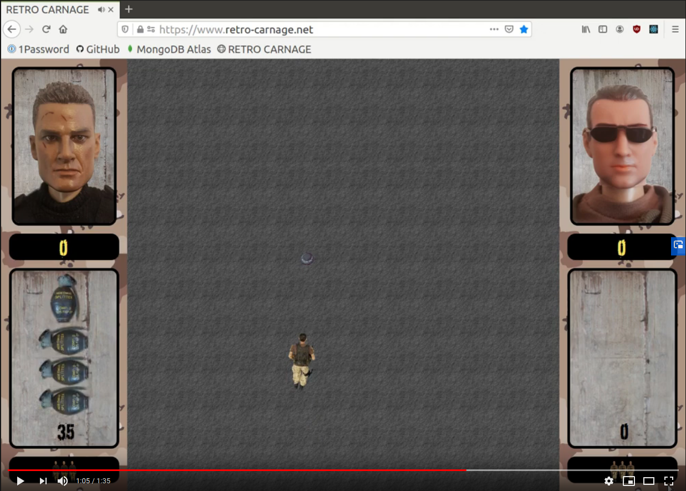
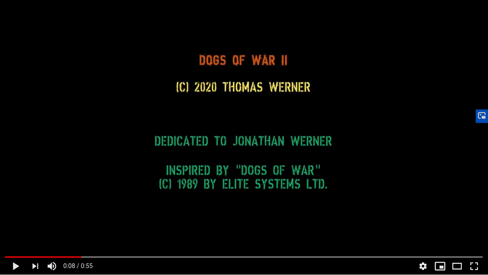

# RETRO CARNAGE

The goal of this project is to build a modern multi-directional scrolling shooter - a worthy successor of the classic
1989 video game [Dogs of War](https://gamesdb.launchbox-app.com/games/details/41090) by
[Elite Systems](http://www.elite-systems.co.uk).

This game is currently under active development. At the moment you can test different concepts of the game but there is
no gripping gameplay.

An unfinished game does not deter you? Then you can find the current state of development on the official homepage of
the game: [http://www.retro-carnage.net](http://www.retro-carnage.net).

Development status 2020-08-25

Development status 2020-04-17

## Usage statistics

