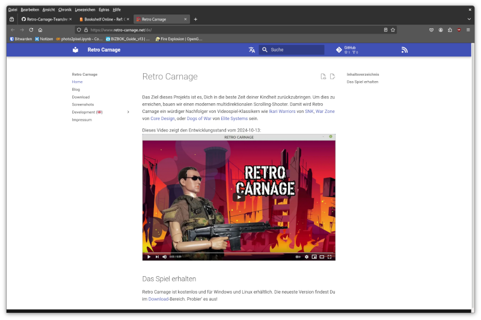

 

# Retro Carnage Website

This repository contains the [website](https://www.retro-carnage.net) of the [Retro-Carnage project](https://github.com/Retro-Carnage-Team).

## Getting started

### Prerequisites

* [Python](https://www.python.org/)
* [MkDocs](https://www.mkdocs.org)
* [mkdocs-material](https://github.com/squidfunk/mkdocs-material)

### Building

To build the page you just need to clone the repo and run the build script:

`git clone git@github.com:Retro-Carnage-Team/retro-carnage-website.git`  
`cd retro-carnage-website`  
`./build.sh`  

## Authors

- [Thomas Werner](https://github.com/huddeldaddel)

## License

This project is licensed under the MIT License. See the [LICENSE.md](LICENSE.md) file for details.
