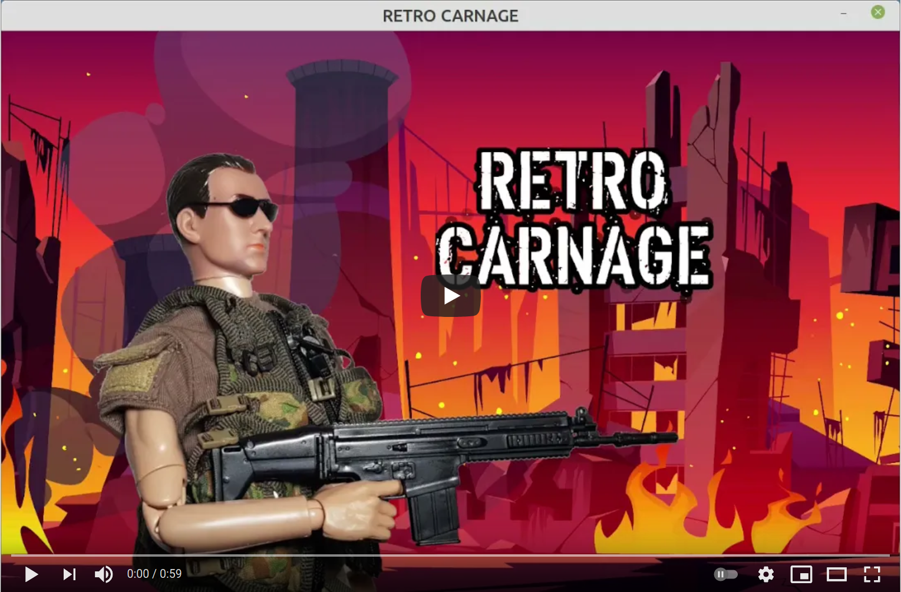

---
hide:
  - toc
---

# Retro Carnage

Das Ziel dieses Projekts ist es, Dich in die beste Zeit deiner Kindheit zurückzubringen. Um dies zu erreichen, bauen wir
einen modernen multidirektionalen Scrolling-Shooter. Damit wird Retro Carnage ein würdiger Nachfolger von 
Videospiel-Klassikern wie [Ikari Warriors](https://en.wikipedia.org/wiki/Ikari_Warriors) von 
[SNK](https://www.snk-corp.co.jp/), [War Zone](https://core-design.com/warzone.html) von 
[Core Design](https://core-design.com/), oder [Dogs of War](https://en.wikipedia.org/wiki/Dogs_of_War_(1989_video_game))
von [Elite Systems](http://www.elite-systems.co.uk) sein.

Dieses Video zeigt den Entwicklungsstand vom 2024-10-13:

 
## Das Spiel erhalten

Retro Carnage ist kostenlos für Windows und Linux erhältlich. Die neueste Version findest Du im 
[Download](download.md)-Bereich. Probier' es aus!

## Triff uns vor Ort

Möchtest Du mehr über unser Projekt erfahren oder mit uns ins Gespräch kommen? Dann hast Du am 23. und 24. August 2025 
die Gelegenheit uns auf der Maker Faire in Hannover zu treffen. Dort hast Du die Möglichkeit Retro Carnage 
auszuprobieren, mit uns an coolen Leveln zu basteln oder einen Blick auf den Code und die Funktionsweise des Spiels 
werfen. Wir freuen uns auf Deinen Besuch!

