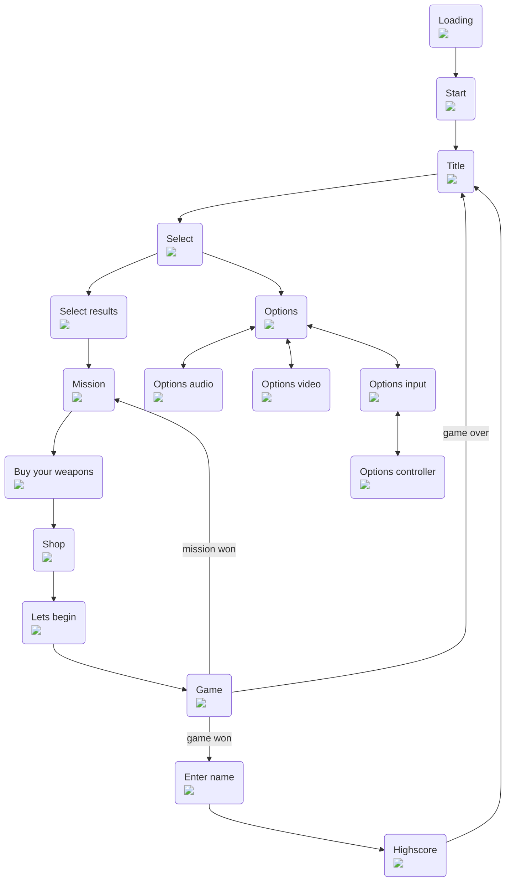

---
hide:
  - toc
---

# Screen flow

The following screen flow diagram shows the possible screen sequences that a user can navigate through.

```mermaid
flowchart TB
    loading("Loading <img src='/en/media/screenshot-loading-small.png'; width='30' />")
    start("Start <img src='/en/media/screenshot-start-small.png'; width='30' />")
    title("Title <img src='/en/media/screenshot-title-small.png'; width='30' />")
    select("Select <img src='/en/media/screenshot-select-small.png'; width='30' />")
    options("Options <img src='/en/media/screenshot-options-small.png'; width='30' />")
    options-audio("Options audio <img src='/en/media/screenshot-options-audio-small.png'; width='30' />")
    options-video("Options video <img src='/en/media/screenshot-options-video-small.png'; width='30' />")
    options-input("Options input <img src='/en/media/screenshot-options-input-small.png'; width='30' />")
    options-controller("Options controller <img src='/en/media/screenshot-options-controller-small.png'; width='30' />")
    select-results("Select results <img src='/en/media/screenshot-select-results-small.png'; width='30' />")
    mission("Mission <img src='/en/media/screenshot-mission-1-small.png'; width='30' />")    
    buy-your-weapons("Buy your weapons <img src='/en/media/screenshot-buy-your-weapons-small.png'; width='30' />") 
    shop("Shop <img src='/en/media/screenshot-shop-small.png'; width='30' />") 
    lets-begin("Lets begin <img src='/en/media/screenshot-lets-begin-small.png'; width='30' />") 
    game("Game <img src='/en/media/screenshot-demo-mission-1-small.png'; width='30' />") 
    enter-name("Enter name <img src='/en/media/screenshot-missing-small.png'; width='30' />")  
    highscore("Highscore <img src='/en/media/screenshot-missing-small.png'; width='30' />")  

    loading --> start --> title --> select --> select-results --> mission --> buy-your-weapons --> shop --> lets-begin --> game
    game-- game over -->title
    game-- game won -->enter-name --> highscore --> title
    game-- mission won -->mission
    select --> options
    options <--> options-audio
    options <--> options-video
    options <--> options-input <--> options-controller
```
