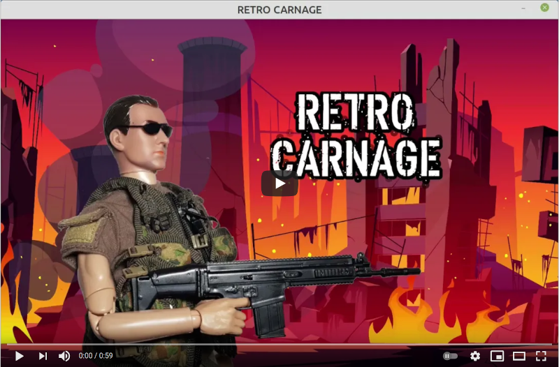

---
hide:
  - toc
---

# Retro Carnage

The goal of this project is to take you back to the best part of your childhood. To do this, we are building a modern
multidirectional scrolling shooter. Once finished, Retro Carnage is going to be a worthy successor of classic video
games like [Ikari Warriors](https://en.wikipedia.org/wiki/Ikari_Warriors) by [SNK](https://www.snk-corp.co.jp/),
[War Zone](https://core-design.com/warzone.html) by [Core Design](https://core-design.com/), or
[Dogs of War](https://en.wikipedia.org/wiki/Dogs_of_War_(1989_video_game))
by [Elite Systems](http://www.elite-systems.co.uk).

Development status as of 2024-10-13

## Getting the game

Retro Carnage is free and available for Windows and Linux. You can find the latest release in the [Download](download.md) section.
Give it a try!
