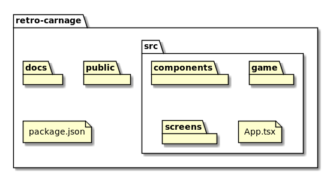

# Frontend

The frontend is the core piece of Retro-Carnage. The game has been implemented as a Single Page Application that is
running in all modern browsers. The frontend contains everything required to build and run the game. The game is written
in [TypeScript](https://www.typescriptlang.org/), uses the [React](https://reactjs.org/) framework to render the various
pages that lead to the game itself. The game engine, also written in TypeScript, uses an HTML 5 canvas element for
graphics.

## Structure

| Component          | Description                                                                                                                                                      |
| ------------------ | ---------------------------------------------------------------------------------------------------------------------------------------------------------------- |
| **docs**           | The docs you are currently reading. The docs are written in Markdown. [MkDocs](https://www.mkdocs.org) is used to compile a static website from these files.     |
| **public**         | This folder becomes the root folder of the deployed game. It contains all static assets that get deployed to the web server - like images, CSS, sounds or fonts. |
| **src**            | Contains the source code and unit tests of the game.                                                                                                             |
| **src/components** | Reusable components that are shared between different screens.                                                                                                   |
| **src/game**       | The custom made game engine.                                                                                                                                     |
| **src/screens**    | Contains components for the various screens - e.g. for configuration, selecting a mission or the shop.                                                           |
| **src/App.tsx**    | This is the main React component. Start here if you want to check the React component structure.                                                                 |
| **package.json**   | Node.js package file that lists dependencies and defines build commands.                                                                                         |

## Build & Run

### The game

- Make sure to have a recent version of [Node.js](https://nodejs.org) installed. Development of the game happens on
  v10.19.0 - so this should work for sure.
- Get the latest source code from [GitHub](https://github.com/huddeldaddel/retro-carnage).
- Open you command line, navigate to the project folder.
- Run `npm install` to download and install all required dependencies.
- Run `npm run build` to create a production build of the source code. This will result in a bunch of static files and
  assets in **./build**. Copy this folder to a web server, and you're ready to go.
- If you want to try out the code locally or want to develop, run `npm run start` instead. This will build the sources
  and start a development server locally on [http://localhost:3000/](http://localhost:3000/). It will notice any changes
  you make to the source code and update the build accordingly.

### The documentation

The documentation uses MkDocs to transform Markdown documents into static HTML and JavaScript files.

- Make sure to have a recent version of MkDocs installed. Development of the game happens with version 1.0.4 running on
  Python 3.8.
- Get the latest source code from [GitHub](https://github.com/huddeldaddel/retro-carnage).
- Open you command line, navigate to the project folder.
- Run `mkdocs build` to create a production build of the documentation. This will result in a bunch of static files and
  assets in **./site**. Copy this folder to a web server, and you're ready to go.
- If you want to open the documentation locally or want to work on it, run `mkdocs serve` instead. This will build the
  docs and start a local server on [http://localhost:8000/](http://localhost:8000/). It will notice any changes you make
  to the documentation files and update the build accordingly.

## Hosting

Both the frontend and the documentation consist of static files only. This makes it very easy to find a suitable hosting
solution, e.g.:

- [Amazon - AWS S3](https://docs.aws.amazon.com/AmazonS3/latest/dev/WebsiteHosting.html)
- [Microsoft - Azure Storage](https://docs.microsoft.com/en-us/azure/storage/blobs/storage-blob-static-website)
