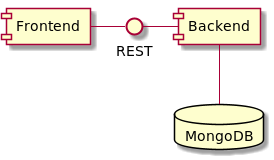

# Retro Carnage

The goal of this project is to build a modern multi-directional scrolling shooter - a worthy successor of the classic
1989 video game [Dogs of War](https://gamesdb.launchbox-app.com/games/details/41090) by
[Elite Systems](http://www.elite-systems.co.uk). This game is currently under active development. At the moment you can
test different concepts of the game but there is no gripping gameplay. If an unfinished game does not deter you, then
you can find the current state of development on the official homepage of the game:
[http://www.retro-carnage.net](http://www.retro-carnage.net).

This documentation provides an overview about the structure of the project and its building blocks. Building and running
the game on your own infrastructure is easy - this document explains how.

## Structure

| Component                   | Description                                                                                         |
| --------------------------- | --------------------------------------------------------------------------------------------------- |
| **[Frontend](frontend.md)** | A web application that contains everything required to run the game.                                |
| **[Backend](backend.md)**   | An optional extension to the frontend. It's used to collect anonymous usage data and error reports. |
| **MongoDB**                 | The backend stores all permanent data in this NoSQL database.                                       |

## Resources

- [Game website](http://www.retro-carnage.net)
- [Frontend on GitHub](https://github.com/huddeldaddel/retro-carnage)
- [Backend on GitHub](https://github.com/huddeldaddel/retro-carnage-backend)
- [Gameplay videos on YouTube](https://www.youtube.com/channel/UCzZqwKAbXmn_azXxBgwWS3g)
